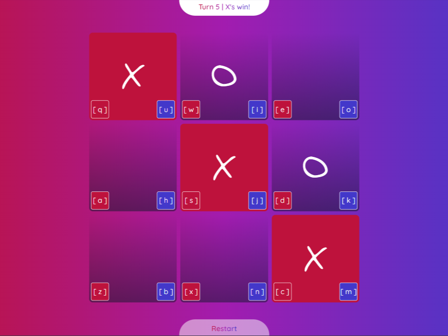

<p align="center">
    <a href="" rel="noopener">
    </a>
</p>

# <h3 align="center">Endless Tic-Tac-Toe</h3>

---

<p align="center">
    Not actually endless, but you get to play this Tic-Tac-Toe untill one of the player won the game. There are a lot more strategy and moves you could use to achieve victory than ordinary Tic-Tac-Toe. 
    <br> 
</p>

</a>

##  How to Play

- You play it like any ordinary Tic-Tac-Toe game, but it won't end when all the squares are filled, since it won't reach that state!
- ${\color{white}X}$ makes the first move. 
- Both ${\color{white}X}$ and ${\color{white}O}$ only place up to 3  pieces each on the board at any time. 
- If there are 3 of ${\color{white}X}$ or ${\color{white}O}$ on the board, the color would change to ${\color{red}X}$ and ${\color{blue}O}$, respectively. 
- When a piece changes color, it indicates that it will be banished from the board in the next turn. 
- Use this opportunity to plan clever strategies and moves to win the game!

## Additional Control for Desktop

When you play using the Desktop, it might be a drag to take turn using touch pad or mouse to select the board. 

So, I made some simple shortcut you can use to ease the gameplay. It might not really be a familiar layout, but I guess it's better than nothing :) 

Here's the keyboard shortcut you can use as player ${\color{white}X}$ and player ${\color{white}O}$. 

```
+-----------+-----------+-----------+
| Player  X |   Board   | Player  O |
|-----------|-----------|-----------|
| [q][w][e] | [1][2][3] | [u][i][o] |
| [a][s][d] | [4][5][6] | [h][j][k] |
| [z][x][c] | [7][8][9] | [b][n][m] |
+-----------+-----------+-----------+
```
